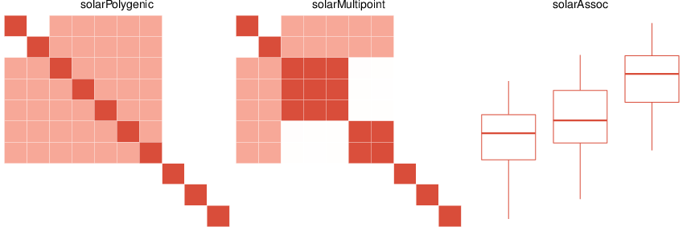

[](https://cran.r-project.org/web/packages/solarius)
[](http://cranlogs.r-pkg.org/badges/solarius)
[](http://cranlogs.r-pkg.org/badges/grand-total/solarius)
[](http://depsy.org/package/r/solarius)

## Table of content

* [About solarius](#about-solarius)
  * [solarius references](#solarius-references)
  * [Install](#install)
  * [Quick start](#quick-start)
  * [Citation](#citation)
  * [Rationale](#rationale)
* [FAQ](faq)
* [SOLAR references](#solar-references)

## About solarius



SOLAR is the old-school player in the quantitative trait loci (QTLs) mapping field ([>2600](https://scholar.google.es/citations?view_op=view_citation&hl=en&user=AjEIQ3MAAAAJ&citation_for_view=AjEIQ3MAAAAJ:u5HHmVD_uO8C) citations).
The SOLAR software implements variance components or linear mixed models
for the analysis of related individuals in pedigrees.

`solarius` is an interface between R and SOLAR, that allows the user to access easily to the main three models: polygenic, association and linkage.

| Model |	SOLAR cmd |	`solarius` function |	`solarius` S3 classe | Parallel computation |
|-------|---------------|---------------------|-----------------------|----------------------|
| [Polygenic](http://ugcd.github.io/solarius/vignettes/tutorial.html#polygenic-model-in-solar) | [polygenic](http://helix.nih.gov/Documentation/solar-6.6.2-doc/91.appendix_1_text.html#polygenic) | solarPolygenic | solarPolygenic | None |
| [Linkage](http://ugcd.github.io/solarius/vignettes/tutorial.html#linkage-model-in-solar) | [multipoint](http://helix.nih.gov/Documentation/solar-6.6.2-doc/91.appendix_1_text.html#multipoint) | solarMultipoint | solarMultipoint, solarPolygenic | Custom  |
| [Association](http://ugcd.github.io/solarius/vignettes/tutorial.html#association-model-in-solar) | [mga](http://helix.nih.gov/Documentation/solar-6.6.2-doc/91.appendix_1_text.html#mga) | solarAssoc |	solarAssoc, solarPolygenic | Automatic or custom |

### solarius references

* The stable release on [CRAN](https://cran.r-project.org/package=solarius)
* The article describing `solarius` in [Bioinformatics](http://bioinformatics.oxfordjournals.org/content/32/12/1901)
    * The preprint version is available in [biorxiv](http://biorxiv.org/content/early/2015/12/25/035378) (the content in Section 2 is different)
* Vignettes 
  * R code [vignettes/](vignettes/)
  * hmlt output:
     1. [tutorial.html](http://ugcd.github.io/solarius/vignettes/tutorial.html)
     2. [minimal.html](http://ugcd.github.io/solarius/vignettes/minimal.html)
     3. [modelsGAIT1.html](http://ugcd.github.io/solarius/vignettes/modelsGAIT1.html)
* Documentation [http://ugcd.github.io/solarius/doc/](http://ugcd.github.io/solarius/doc/) (out of date)
* Project web [http://ugcd.github.io/solarius/](http://ugcd.github.io/solarius/) (out of date)

### Install

To install the official release from [CRAN](https://cran.r-project.org/package=solarius):

```
install.packages("solarius")
```

To install the latest development version from source on GitHub (master branch): 

```
library(devtools)
install_github("ugcd/solarius")
```

_Note 1_: Starting from version 3.*, `solarius` is not supported for Windows. 
[DESCRIPTION](https://github.com/ugcd/solarius/blob/master/DESCRIPTION) file has a special line `OS_type: unix`.
This is a clear limitation of the `solarius` package that comes from the dependency on SOLAR.
See also the SOLAR [FAQ](http://solar-eclipse-genetics.org/faq.html) 
and the question 4 "Can SOLAR-Eclipse only be downloaded in the linux version?".

_Note 2_: The `solarius` user needs to install and _register_ SOLAR, that might the most annoying part of the installation process.
Please see the Installation [section](http://ugcd.github.io/solarius/vignettes/tutorial.html#installation) of the tutorial vignette.

### Quick start

Please see the vignette [minimal.html](http://ugcd.github.io/solarius/vignettes/minimal.html).


## FAQ

Q2: I was wondering whether there was any support for user-defined omega functions, or any slightly more complicated variance components models (e.g. to allow different variance components for males and females, or to report results as variance components rather than proportions of variance)?  If not, are there any plans to incorporate these in future? 

A2: The `solarius` package supports only three basic models: `polygenic`, `multipoint` and `mga` commands of SOLAR. 

In future versions of `solarius`, we don't plan to include any complex models, mainly because the SOLAR environment is not as user-friendly as R, for example. In addition, GxE tcl scripts are not publicly available (in our group, we did some other analyses like GxE with custom tcl scripts using exclusively SOLAR).

Q3: When I tried to install the package, this was the message I got:

```
> install.packages(“solarius”)

Warning message:
package ‘solarius’ is not available (for R version 3.2.2)
``` 

Could you please let me know what I have done wrong and correct way to install the package?

A3: I suspect that you might have the Windows system, for which `solarius` is not supported. That is because of the dependence on SOLAR.

Please see the installation notes on [http://ugcd.github.io/solarius/vignettes/tutorial.html#installation](http://ugcd.github.io/solarius/vignettes/tutorial.html#installation). 
 

### Citation

To cite the `solarius` package in publications use:

```
  Ziyatdinov et al., solarius: an R interface to SOLAR for variance
  component analysis in pedigrees, Bioinformatics (2016)
```

A BibTeX entry for LaTeX users is:

```
  @article{ziyatdinov2016solarius,
    title = {solarius: an R interface to SOLAR for variance component analysis in pedigrees},
    author = {Andrey Ziyatdinov and Helena Brunel and Angel Martinez-Perez and Alfonso Buil and Alexandre Perera and Jose Manuel Soria},
    year = {2016},
    publisher = {Oxford Univ Press},
    journal = {Bioinformatics},
    pages = {btw080},
    url = {http://bioinformatics.oxfordjournals.org/content/32/12/1901},
  }
```

### Rationale

The rationale behind the `solarius` software:

* do not automate things in R, which `SOLAR` has already automated
    * call `SOLAR` by `system` R base function passing options/settings to SOLAR as parameters
* make it more R self-content and independent on other programs
    * phenotypes format as `data.frame`
    * make use of R plots like plotting pedigrees
    * make use of parallelization insfrastructure available in R
    * do not rely on tcl  scripts anymore
* get rid of `salamboR` artifacts (ancestor of `solarius`)
    * GAIT-specific functions
    * interface with other programs than `SOLAR`
    * lost version-control traces
    * dependence on old-school code from previous mantainers
    * dependence on (many) tcl scripts
* get rid of `SOLAR` artifacts
    * store models/phenos in folders/files
* make use of github infrastructure: collaborative coding, issues, gh-pages, etc
 
On the SOLAR side:

* Designed for the family-based studies (HHID, PROBND, FAMID descriptors of individuals)
    * support of extended pedigrees
* Stable routines for optimization of VC models
* Advanced polygenic models
    * support of multivariate models
    * liability threshold model (probit)
    * LRT applied to both covariates and variance components
* Elaborated linkage models
    * Multi-pass
    * Multivariate
    * Adjustment of LOD scores
* Association models
    * Speed-up based on residuals
* Advanced VC models (custom scripts)
    * Sex-specificity 
    * Longitudinal

On the R side:

* Interactive environment for data manipulation
* Graphics
    * Plot residuals, QQ-plot, Manhattan plot
* Parallel computing

## SOLAR references

* The new [SOLAR web page](http://solar-eclipse-genetics.org/) (SOLAR-Eclipse)
    * The old [SOLAR web page at txbiomedgenetics.org](http://solar.txbiomedgenetics.org/) (depreciated)
* [Appendix 1. SOLAR Command Descriptions](http://helix.nih.gov/Documentation/solar-6.6.2-doc/91.appendix_1_text.html)

