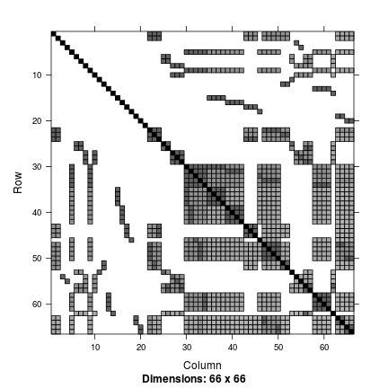
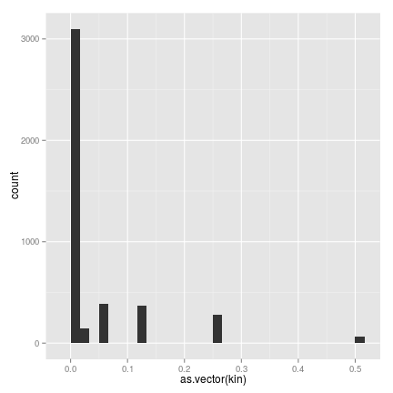

  

### Data set `dat30`

~~~ r
data(dat30)
~~~

~~~ r
str(dat30)
~~~

~~~
## 'data.frame':	174 obs. of  10 variables:
##  $ famid : int  1 1 1 1 1 1 2 2 2 2 ...
##  $ id    : int  11 12 13 14 15 16 21 22 23 24 ...
##  $ fa    : int  0 0 11 11 11 11 0 0 21 21 ...
##  $ mo    : int  0 0 12 12 12 12 0 0 22 22 ...
##  $ sex   : int  1 2 1 2 1 1 1 2 2 1 ...
##  $ affect: int  2 2 2 2 2 2 2 2 2 2 ...
##  $ class : logi  NA NA NA NA NA NA ...
##  $ trait1: num  11.96 7.1 10.32 9.76 9.46 ...
##  $ trait2: num  13.58 5.37 6.4 8.98 9.21 ...
##  $ age   : int  50 25 35 49 51 45 37 29 39 41 ...
~~~

### Data set `dat50`

~~~ r
data(dat50)
~~~

~~~ r
library(Matrix)
image(Matrix(kin))
~~~

 

~~~ r
library(ggplot2)
qplot(as.vector(kin))
~~~

 

